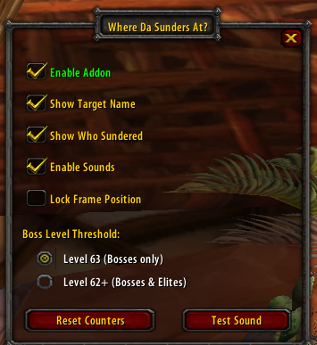

# Where Da Sunders At? (WDSA)

Sunder Armor stack tracker for Turtle WoW

## Features

- Current sunder stacks on target (0-5) with color coding
- Session total sunder count
- Track who applied sunders (via combat log)
- Random sound alerts on sunder application
- Moveable/lockable frame
- Only shows for boss-level enemies (62+/63)
- Minimap button (draggable)
  - Left-click: Open config panel
  - Right-click: Toggle on/off

## Commands

| Command | Description |
|---------|-------------|
| `/wdsa` | Show help |
| `/wdsa on` | Enable addon |
| `/wdsa off` | Disable addon |
| `/wdsa toggle` | Toggle enabled state |
| `/wdsa reset` | Reset position & counters |
| `/wdsa name` | Toggle showing target name |
| `/wdsa who` | Toggle who-sundered display |
| `/wdsa lock` | Lock/unlock frame movement |
| `/wdsa sound` | Toggle sound alerts |
| `/wdsa stats` | Show full sunder breakdown |
| `/wdsa test` | Test sunder sound |
| `/wdsa testno` | Test no-sunders alert |
| `/wdsa level` | Toggle 62/63 alert level (default 63) |

## Sounds

Two sound types:
- `no-sunders.mp3` - Plays when targeting a boss (level 63) with 0 stacks
- `sunders1.mp3`, `sunders2.mp3`, etc - Random sound when sunder is applied

Use `/wdsa level` to include level 62 elites.

Place files in the `sounds/` folder.

## Announce Output

Configurable chat output when sunders are applied:

| Channel | Behavior |
|---------|----------|
| None | No announcements (default) |
| Debug | Print to your chat frame only |
| Say | /say in local chat |
| Yell | /yell in zone |
| Raid/Party | /raid or /party depending on group |

Format: `Player sundered Target 3/5`

## Display Colors

| Color | Meaning |
|-------|---------|
| Red | 0 stacks (no sunders!) |
| Yellow | 1-4 stacks (building) |
| Green | 5 stacks (full!) |
| Gray | No target selected |
